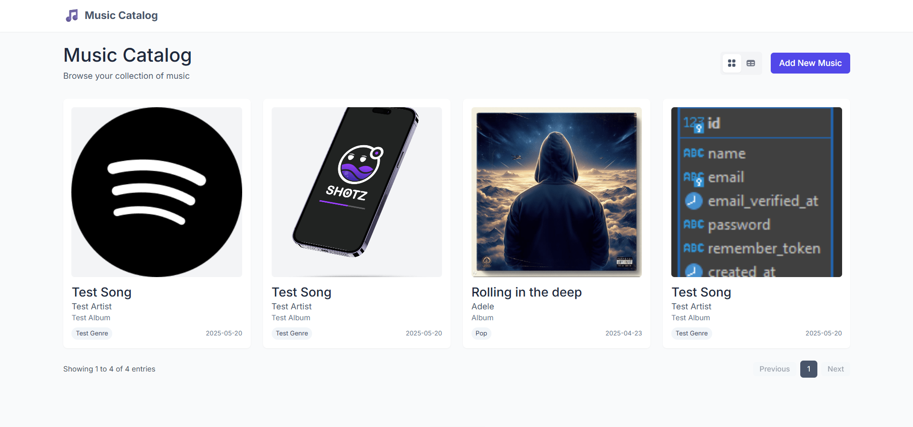
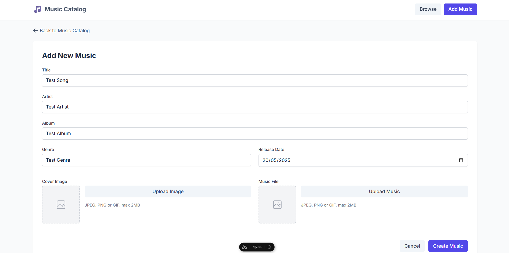
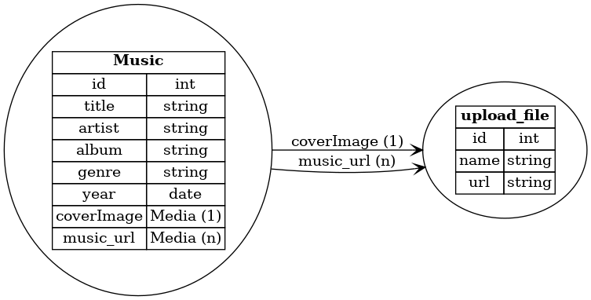
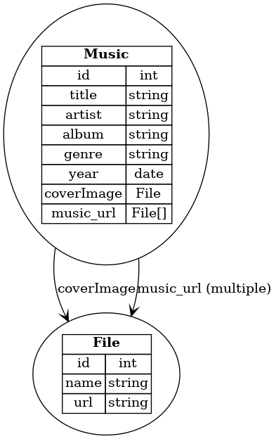
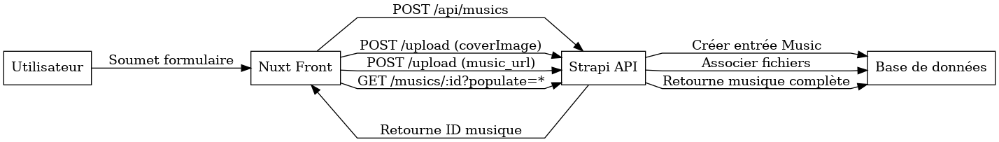
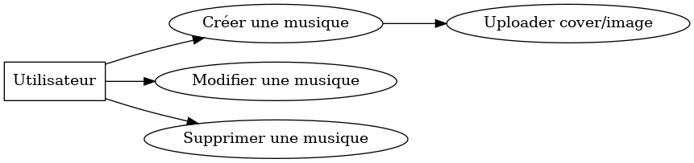

# 🎵 Music Catalog – Application Nuxt 3 + Strapi 5

Ce projet est une application de catalogue musical développée avec Nuxt 3 (Vue 3 + TypeScript) et alimentée par un backend Strapi 5. Il permet aux utilisateurs de créer, lire, mettre à jour et supprimer des entrées musicales, y compris l'upload de fichiers audio et d'images de couverture.

---

## 📁 Structure du projet

Le dépôt contient uniquement le frontend Nuxt 3. Le backend Strapi est géré séparément.

```
project/
├── assets/
├── components/
├── composables/
├── layouts/
├── pages/
├── public/
├── types/
├── nuxt.config.ts
├── package.json
├── tsconfig.json
└── ...
```

---

## 🚀 Fonctionnalités

* CRUD complet sur les musiques
* Upload d'images de couverture et de fichiers audio
* Lecture audio intégrée avec `MusicfyPlayer`
* Pagination et affichage en grille ou tableau
* Formulaires avec validation via Yup
* Intégration avec Strapi 5 via API REST([market.strapi.io][1])

---

## ✅ Prérequis

* Node.js v18 ou supérieur
* npm v9 ou supérieur
* Strapi 5 (backend) déjà installé et fonctionnel
* Fichier d'export Strapi disponible (`.tar.gz.enc`)([docs.strapi.io][2])

---

## 🛠️ Installation

1. **Cloner le dépôt**

   ```bash
   git clone https://github.com/Robitch/strapi-nuxt-music-crud.git
   cd strapi-nuxt-music-crud
   ```

2. **Installer les dépendances**

   ```bash
   npm install
   ```

3. **Configurer les variables d'environnement**

   Créer un fichier `.env` à la racine du projet avec le contenu suivant :

   ```env
   STRAPI_API_URL=http://localhost:1337/
   ```


> Remplacez l'URL si votre instance Strapi est hébergée ailleurs.

4. **Lancer le serveur de développement**

   ```bash
   npm run dev
   ```

   L'application sera accessible sur `http://localhost:3000`.

---

## 🔄 Intégration avec Strapi 5

### 📦 Importer les données Strapi

Vous disposez d'un fichier d'export Strapi (`.tar.gz.enc`) à la racine du projet cloné. Vous pouvez l'importer dans votre instance Strapi existante.([docs.strapi.io][2])

1. **Vérifier que le fichier d'export dans le répertoire de votre projet Strapi**

2. **Exécuter la commande d'importation**

   ```bash
   npm run strapi import -- --file ./my-strapi-export.tar.gz.enc
   ```


> L'importation supprimera toutes les données existantes dans votre instance Strapi avant d'importer les nouvelles données.

### ⚠️ Attention

* Assurez-vous que l'instance Strapi est arrêtée avant d'exécuter la commande d'importation.
* Les utilisateurs administrateurs et les tokens API ne sont pas inclus dans l'export/import.

---

## 📸 Captures d'écran




---

## 📄 Spécifications Générales

### 🗃️ Schéma relationnel



### 📊 Diagrammes UML





### 🛣️ Routes API

| Méthode | URL | Description | Corps attendu / envoyé |
| --- | --- | --- | --- |
| GET | /api/musics?populate=* | Liste toutes les musiques |  |
| GET | /api/musics/:id?populate=* | Récupère une musique par ID |  |
| POST | /api/musics | Crée une musique (sans média) | { data: { title, artist, ... } } |
| PUT | /api/musics/:id | Met à jour une musique | { data: { ... } } |
| DELETE | /api/musics/:id | Supprime une musique |  |
| POST | /api/upload | Upload un fichier et l’associe | FormData: files, ref, refId, field |

---

## 📄 Licence

Ce projet est sous licence MIT.


[1]: https://market.strapi.io/plugins/strapi-import-export?utm_source=chatgpt.com "Import Export 5 - Strapi, the leading open-source headless CMS"
[2]: https://docs.strapi.io/cms/cli?utm_source=chatgpt.com "Command Line Interface (CLI) - Strapi 5 Docs"
[3]: https://docs.strapi.io/cms/data-management/export?utm_source=chatgpt.com "Data export | Strapi 5 Documentation"
